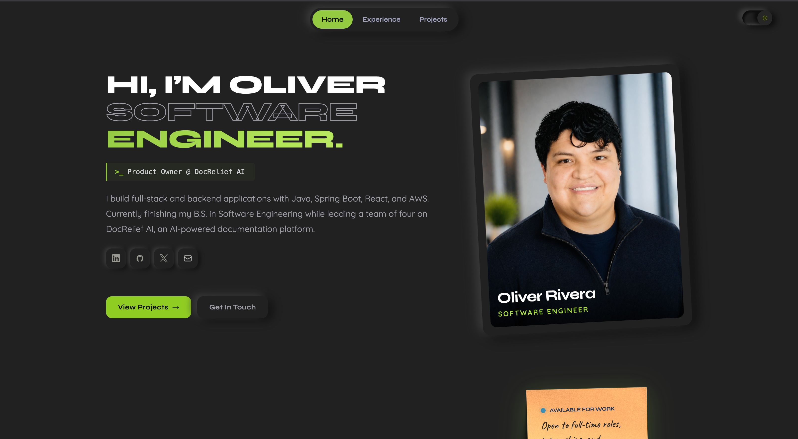

# Oliver Rivera's Portfolio

[](https://oliver-rivera-portfolio.vercel.app)



Personal portfolio showcasing my projects, skills, and experience as a Software Engineer.

## Features

- Scroll-driven section animations and direction-aware reveals
- Hero photo card with neumorphic frame, gradient backdrop, and hover parallax
- Horizontal project showcase with scroll-jacking
- Contact form with server-side email delivery via Nodemailer
- WebGL fluid ambient background (desktop only), dark/light mode

## Tech Stack


## Design

Neumorphic design language with a lime accent throughout; soft depth on cards and
icons, scroll-driven section color shifts, and a WebGL fluid ambient background on
desktop. The hero photo card uses a background-removed cutout over a procedurally
generated gradient with a diagonal hatch texture.

Key decisions:

- Mobile-first layout that degrades gracefully (WebGL disabled on touch devices)
- Scroll-reveal animations driven by scroll direction, not just IntersectionObserver
- Contact form handled server-side via Nodemailer. No third-party form services

## Run Locally

```bash
pnpm install
pnpm dev
```

Open http://localhost:3000

## Deployment

Deployed automatically to Vercel on every push to `main`.

## Contact

[orivera94@gmail.com](mailto:orivera94@gmail.com)